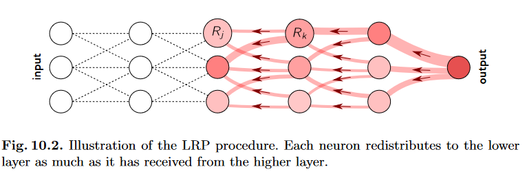

# LRP for keras models
Basic implemention of LRP for keras models, adapted from https://git.tu-berlin.de/gmontavon/lrp-tutorial

# LRP 
Layer-Wise Relevance propagation is an explainability technique that works by propagating the prediction backward through the neural network based on predifined rules. 

